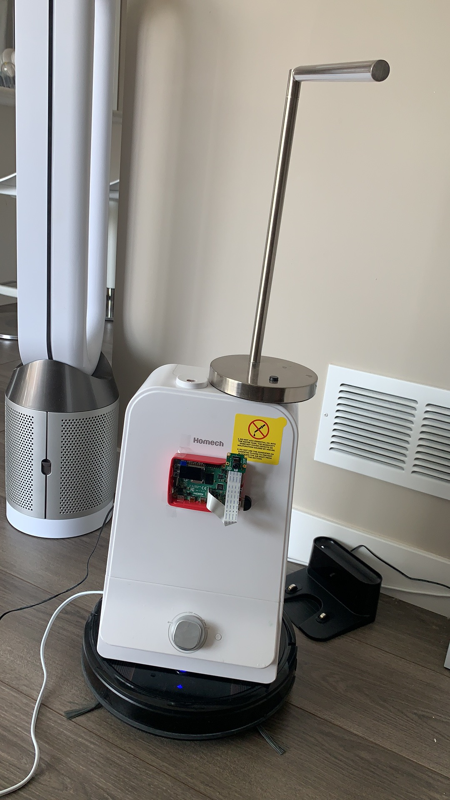
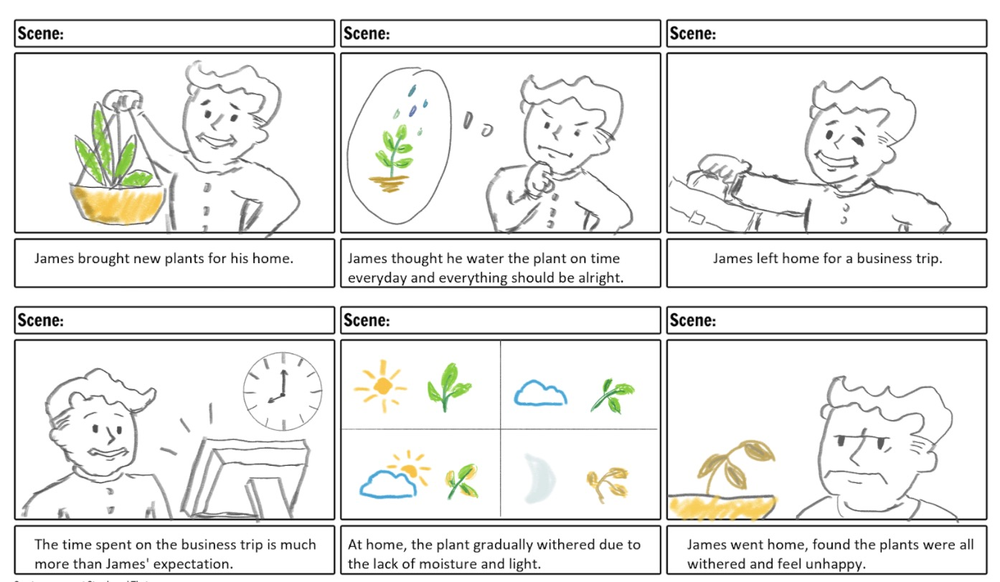
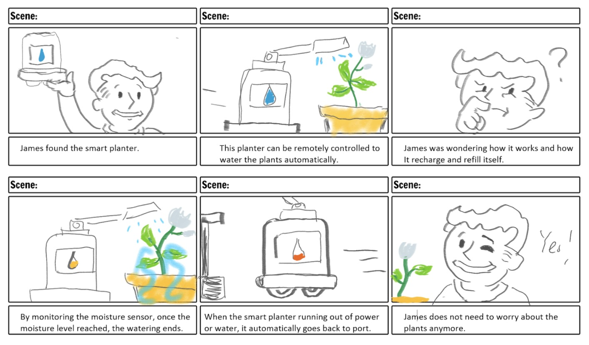
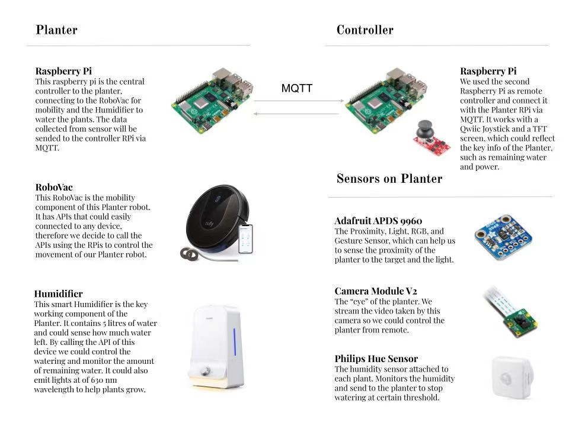
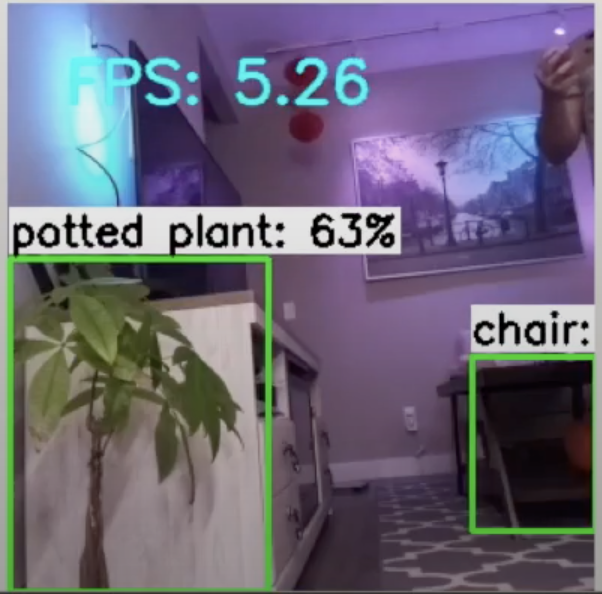

# Final Project

Using the tools and techniques you learned in this class, design, prototype and test an interactive device.

Functional check-off - May 10

Final Project Presentations (video watch party) - May 12


## Objective

The goal of this final project is for you to have a fully functioning and well-designed interactive device of your own design.

## Description
Introducing the smart planter, the ideal intelligent planter which leverages both the pattern recognition inspired by the idea of Lab 5 and the remote control via MQTT that we explored in Lab 6. As a team of plant lovers, although we pay a lot of attention to the plant we grow, it is still inevitable to make mistakes sometimes.

We summarized the mistakes and found that in more than half of the incidents that cause moderate to severe damage to the plants are simply due to the lack of care: forget to water them on time, or overwatering, could cause serious consequences to them. As a result, we were considering utilizing the hardwares and techs we learned from IDD to build a smart planter to take care of these treasured plants automatically.

At the beginning stage, we just listed the key components it should have:

(1) A humidifier which could water the plants
(2) A chassis with wheels to give mobility to the planter
(3) A control unit (A Raspberry Pi, of course)

Considering the possibility of self-driving or at least remote-controllable, we also attached a camera for monitoring/pattern recognition and a lamp for night lighting. This is the prototype we got:



## Deliverables

### 1. Documentation of design process

The idea has been shown below:





Except the RPi and the related hardwares that we familiar already, the key components: the RoboVac, the humidifier, and the humidity sensor are integrated products from third party. Fortunately, we found that they are all controllable via Philips Hue smart home kit. This means, we could call the APIs from Philips hue to control these components as well.


### 2. Archive of all code, design patterns, etc. used in the final design. (As with labs, the standard should be that the documentation would allow you to recreate your project if you woke up with amnesia.)

After we built up the prototype, we surveyed each components and have a basic system diagram below:



The TFT screen and the Camera module V2 are attached to the designated ports (GPIO I/O header and CSI Camera connector, which is the connector situated between the USB and micro-HDMI ports). The RoboVac and the humidifier are connected by LAN (local area networks) and controlled by the local* Raspberry Pi which attached to the smart planter.

On the other hand, the remote* Raspberry Pi takes keyboard inputs using Pygame packages, and sending these instructions to the local RPi via MQTT.

Regarding the smart home kit control, we are using the Raspberry Pi home bridge:

Here are the detailed information from the website of Raspberry Pi Homebridge: https://homebridge.io/

We also referred to this video to figure out the basic settings: https://www.youtube.com/watch?v=x_SGq3O9T5o

The Git repo for RPi OS and the Hue connection: https://github.com/ebaauw/homebridge-hue#readme

And the detailed installation is here: https://github.com/homebridge/homebridge/wiki/Install-Homebridge-on-Raspbian

After setting up the RPi for homebridge connection, simply compile:

```
python water.py
```

This file will turn on the system and try to build connection to the camera. At this point, we used the OpenCV model to assist us recognize the plants in low light conditions. The standard object detection is implemented by utilzing the [Yolo](https://pjreddie.com/darknet/yolo/) darknet.



We are considering making this planter to be fully automated and this standard object detection is key to the function. However, due to the time constraint, we were unable to finish it before the project deadline. However, we thought it is still a cool idea to try in the future.

### 3. Video of someone using your project (or as safe a version of that as can be managed given social distancing)

https://drive.google.com/file/d/1EwjxWuJTz4neTi9kRxdya0_QexPw24z-/view

### 4. Reflections on process (What have you learned or wish you knew at the start?)

1. The learning curve for connecting the RPi with smart home kits is a steep one. Although the Homebridge is a handy tool to use, it may still fails due to the exceptions (network errors, hardware malfunctions, etc.) and it is not a perfectly stable system. As a result, although we learned a lot and admitted it is a rewarding experience, we gave up the idea of fully integrate the Homebridge with all components and have to "wizard" our demo video because otherwise we may experience all different kinds of system failure during the recording.

2. The MQTT is laggy. The idea of remote control is based on the trust of the MQTT connection, however, we found it is more easily to fail than we thought. Since we collaborate remotely, it took even more time to test our system and the time consumed by testing is even more than the time for development. Therefore, we are somehow "forced" to "wizard" or mock up this demo video.

3. The overall experience is fun: we are trying to integrate everything we learned from this course in this final project: the TFT screen display/interactions from Lab 2, physical prototyping from Lab 4, observant systems from Lab 5, and the MQTT connections from Lab 6. We found all these content useful and they empowered us to build a complete system that we want for an open-ended project.


## Teams

We are a team of two: Zhonghao Zhan (zz656) and Panda Xu (px48). We designed this system together. Zhonghao worked on the code design for MQTT remote controller, the homebridge integration, and the remote testing process. Panda worked on the assembly of this system, the hardware testing, and the recording of the demo video.

## Examples

[Here is a list of good final projects from previous classes.](https://github.com/FAR-Lab/Developing-and-Designing-Interactive-Devices/wiki/Previous-Final-Projects)
This version of the class is very different, but it may be useful to see these.
