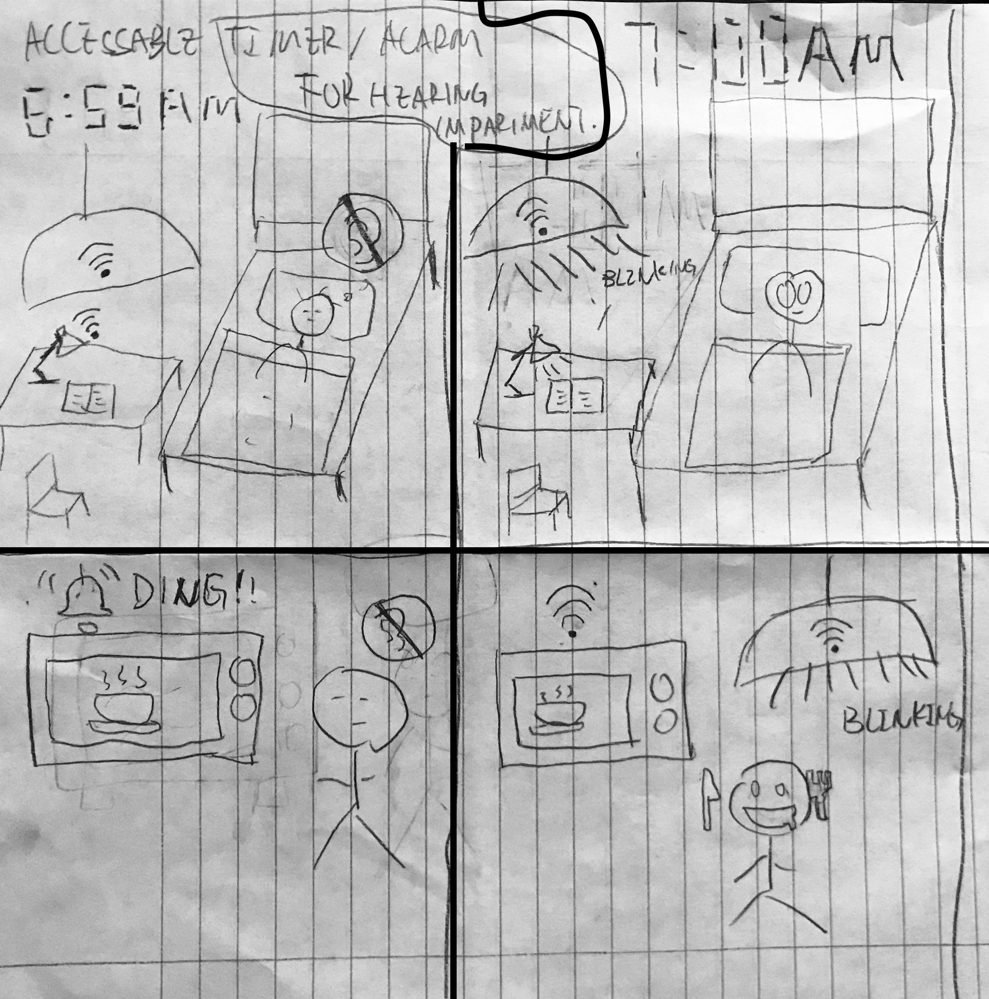
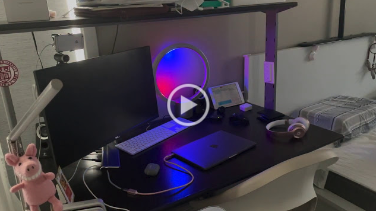
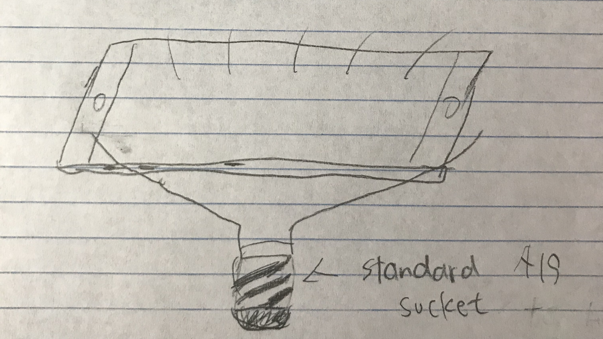
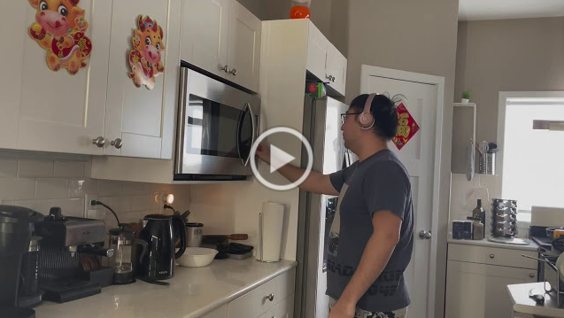
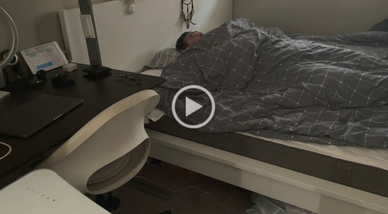

# Staging Interaction

In the original stage production of Peter Pan, Tinker Bell was represented by a darting light created by a small handheld mirror off-stage, reflecting a little circle of light from a powerful lamp. Tinkerbell communicates her presence through this light to the other characters. See more info [here](https://en.wikipedia.org/wiki/Tinker_Bell). 

There is no actor that plays Tinkerbell--her existence in the play comes from the interactions that the other characters have with her.

For lab this week, we draw on this and other inspirations from theatre to stage interactions with a device where the main mode of display/output for the interactive device you are designing is lighting. You will plot the interaction with a storyboard, and use your computer and a smartphone to experiment with what the interactions will look and feel like. _Make sure you read all the instructions and understand the whole of the laboratory activity before starting!_

## Prep

1. Set up [your Github "Lab Hub" repository](../../../) by [following these instructions](https://github.com/FAR-Lab/Developing-and-Designing-Interactive-Devices/blob/2021Spring/readings/Submitting%20Labs.md).
2. Set up the README.md for your Hub repository (for instance, so that it has your name and points to your own Lab 1) and [learn how](https://guides.github.com/features/mastering-markdown/) to post links to your submissions on your readme.md so we can find them easily.

### For lab, you will need:

1. Paper
1. Markers/ Pen
1. Smart Phone--Main required feature is that the phone needs to have a browser and display a webpage.
1. Computer--we will use your computer to host a webpage which also features controls
1. Found objects and materials--you’ll have to costume your phone so that it looks like some other device. These materials can include doll clothes, a paper lantern, a bottle, human clothes, a pillow case. Be creative!
1. Scissors

### Deliverables for this lab are: 
1. Storyboard
1. Sketches/photos of costumed device
1. Any reflections you have on the process.
1. Video sketch of the prototyped interaction.
1. Submit these in the lab1 folder of your class [Github page], either as links or uploaded files. Each group member should post their own copy of the work to their own Lab Hub, even if some of the work is the same for each person in the group.

## Overview
For this assignment, you are going to 

A) [Plan](#part-a-plan) 

B) [Act out the interaction](#part-b-act-out-the-interaction) 

C) [Prototype the device](#part-c-prototype-the-device)

D) [Wizard the device](#part-d-wizard-the-device) 

E) [Costume the device](#part-e-costume-the-device)

F) [Record the interaction](#part-f-record)

## The Report
This readme.md page in your own repository should be edited to include the work you have done. You can delete everything but the headers and the sections between the **stars**. Write the answers to the questions under the starred sentences. Include any material that explains what you did in this lab hub folder, and link it in the readme.

Labs are due on Mondays. Make sure this page is linked to on your main class hub page.

## Part A. Plan 

**Describe your setting, players, activity and goals here.**
The interactive device I propose here is a smart light that can act as a visual alarm to indicate people by interacting with home appliances and electronics. This design is especially helpful for people with hearing impairments. One example is happening in bedroom and an Alexa voice assitant, myself and the smart lighting device will be involved in the interaction. So when my wake-up alarm rings in the mornings in my bedroom, the device will also blink to wake me. Another scenario is hapening in the kitchen and a smart microwave, myself, and the smart lighting device is involved in the interaction. So when food in the microwave is ready, the lights will blink in a user-defined color to indicate me that the food is ready. 

**Include a picture of your storyboard here**

**Summarize feedback you got here.**
1. The light intensity might not be bright enough to effectively indicate users or wake them up, consider to increase the lux(light intensity) and number of light bulbs.
2. It might affect other users who are sharing the same space.

## Part B. Act out the Interaction

Try physically acting out the interaction you planned. For now, you can just pretend the device is doing the things you’ve scripted for it. 

**Are there things that seemed better on paper than acted out?**

The things that seemed better on paper than acted out were that I could assume that everything would work exactly what I wanted with no exception but in reality, a lot of things can go wrong. For example, the Alexa command might not work to wake Alexa up and the WIFI might be slow and affect the timing of the lights.

**Are there new ideas that occur to you or your collaborators that come up from the acting?**

The new ideas that occur to me from the acting are that I can use the smart lighting to indicate the users when someone knocking on the door or when someone trying to break in the door. 

## Part C. Prototype the device

You will be using your smartphone as a stand-in for the device you are prototyping. You will use the browser of your smart phone to act as a “light” and use a remote control interface to remotely change the light on that device. 

Code for the "Tinkerbelle" tool, and instructions for setting up the server and your phone are [here](https://github.com/FAR-Lab/tinkerbelle).

We invented this tool for this lab! 

If you run into technical issues with this tool, you can also use a light switch, dimmer, etc. that you can manually or remotely control.
**Give us feedback on Tinkerbelle.**
In this part, I am using the Webhook APIs in IFTTT to interact with my existing Philips Hue smart lighting system. But I also installed and tried out the Tinkerbelle. I initially encountered some errors during installation and the problem was solved by switching the Python version from 3.8 to 3.7. Not sure why tho. 

## Part D. Wizard the device
Take a little time to set up the wizarding set-up that allows for someone to remotely control the device while someone acts with it. Hint: You can use Zoom to record videos, and you can pin someone’s video feed if that is the scene which you want to record. 

**Include your first attempts at recording the set-up video here.**

**Please change the video quality to 1080p manually** 

Now, change the goal within the same setting, and update the interaction with the paper prototype. 

**Show the follow-up work here.**

## Part E. Costume the device

Only now should you start worrying about what the device should look like. Develop a costume so that you can use your phone as this device.

Think about the setting of the device: is the environment a place where the device could overheat? Is water a danger? Does it need to have bright colors in an emergency setting?

**Include sketches of what your device might look like here.**

**What concerns or opportunitities are influencing the way you've designed the device to look?**

The concern is that the lights might not be responsive and acting slow due to weak WiFi signal and congested WiFi traffic. Also, during the daytime, the lights might not be as visible as at night time, which might hard to see and alarm users. Therefore, I might use a Zigbee relay on the light bulb instead of using WiFi for low latency. I will probably add more light beads to the LED so the device can be even brighter and be visible during night time.

An opportunity that influences me is the Philips Hue smart lighting, which gives me the ability to control the lights remotely. I also make use of the WebHook API in IFTTT to link my Alexa alarm and my lights together. 
## Part F. Record

**Take a video of your prototyped interaction.**

**Please change the video quality to 1080p manually** 

**Please indicate anyone you collaborated with on this Lab.**

[Philips Hue Lightbulbs](https://philips-hue.com), [C by GE smart light](https://gelighting.com), [Amazon Alexa](https://alexa.amazon.com), [IFTTT WebHook](https://ifttt.com/maker_webhooks), [simerlyd’s Applets on IFTTT](https://ifttt.com/applets/tnqLbTAN-flash-philips-hue-lights-red-when-alexa-alarm-goes-off)

# Staging Interaction, Part 2 

This describes the second week's work for this lab activity.

## Prep (to be done before Lab on Wednesday)

You will be assigned three partners from another group. Go to their github pages, view their videos, and provide them with reactions, suggestions & feedback: explain to them what you saw happening in their video. Guess the scene and the goals of the character. Ask them about anything that wasn’t clear. 

**Summarize feedback from your partners here.**

Songyu Du:
In the 1st video, I saw the user use a microwave but he didn’t notice the beep of microwave because he was wearing a headphone. The user was reminded by the blinking lights in the living room that the food was ready. In the 2nd video, the user was sleeping with a headphone, and he was weaken up by the blinking lights in the bedroom. I must say the interactions seemed so fun. I personally want to have this installment at my home too.
Scene: At home when the user’s hearing is occupied or even the user is hearing impaired. 
Goal: A visual alarm that helps people with hearing impairments live well at home.
Not clear: Does the user need to control this device (setting up alarm, which light blinks for which interaction) using smart phone? How would you turn the light alarm off (especially that for microwave)? Seemed like the lights blink till the end of your video.

Renzhi Hu:
What’s happening: 
you used the lighting device to setup timer and alarms to notify and help hearing impaired users when the time’s up.

The scene and the goals of the character: 
Scene 1: microwaving food; The goal: notify the user when the food is done
Scene 2: waking up in the morning; The goal: use intense lighting to wake user up

Anything that wasn’t clear: 
How the alarm is set isn’t being showed in the videos. How to turn off the lighting? What happens if the user wasn’t around and didn’t see the light?

Wenqing Tang:
I think overall it's a really great idea, and it already works pretty well :slightly_smiling_face: The only suggestion I can give is sometimes there might be multiple things in need of the lighting indication at the same time, e.g. the food is heated by microwave and maybe the laundry is done too, so maybe you can think a little about how to handle situations like this while still let the light shown in a wide range (like you are doing right now) so that people won't miss it.

## Make it your own

Do last week’s assignment again, but this time: 
1) It doesn’t have to (just) use light, 
2) You can use any modality (e.g., vibration, sound) to prototype the behaviors, 
3) We will be grading with an emphasis on creativity. 

**Document everything here.**
