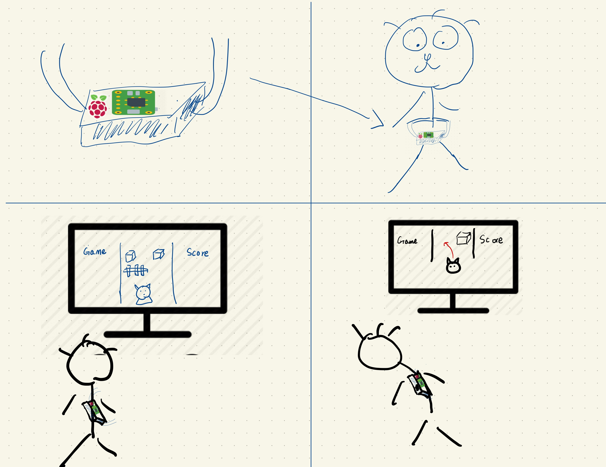
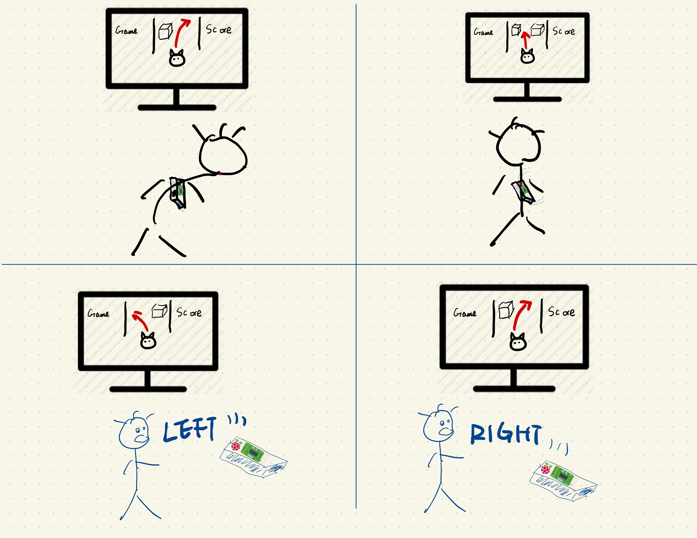

# You're a wizard, [Student Name Here]


In this lab, we want you to practice wizarding an interactive device as discussed in class. We will focus on audio as the main modality for interaction but there is no reason these general techniques can't extend to video, haptics or other interactive mechanisms. In fact, you are welcome to add those to your project if they enhance your design.


## Text to Speech and Speech to Text

In the home directory of your Pi there is a folder called `text2speech` containing some shell scripts.

```
pi@ixe00:~/text2speech $ ls
Download        festival_demo.sh  GoogleTTS_demo.sh  pico2text_demo.sh
espeak_demo.sh  flite_demo.sh     lookdave.wav

```

you can run these examples by typing 
`./espeakdeom.sh`. Take some time to look at each script and see how it works. You can see a script by typing `cat filename`

```
pi@ixe00:~/text2speech $ cat festival_demo.sh 
#from: https://elinux.org/RPi_Text_to_Speech_(Speech_Synthesis)#Festival_Text_to_Speech

echo "Just what do you think you're doing, Dave?" | festival --tts

```

You can also play audio files directly with `aplay filename`.

After looking through this folder do the same for the `speech2text` folder. In particular, look at `test_words.py` and make sure you understand how the vocab is defined. Then try `./vosk_demo_mic.sh`

## Serving Pages

In Lab 1 we served a webpage with flask. In this lab you may find it useful to serve a webpage for the controller on a remote device. Here is a simple example of a webserver.

```
pi@ixe00:~/$ python server.py
 * Serving Flask app "server" (lazy loading)
 * Environment: production
   WARNING: This is a development server. Do not use it in a production deployment.
   Use a production WSGI server instead.
 * Debug mode: on
 * Running on http://0.0.0.0:5000/ (Press CTRL+C to quit)
 * Restarting with stat
 * Debugger is active!
 * Debugger PIN: 162-573-883
```
From a remote browser on the same network, check to make sure your webserver is working by going to [http://ixe00.local:5000]()


## Demo

In the [demo directory](./demo), you will find an example wizard of oz project you may use as a template. **You do not have to** feel free to get creative. In that project, you can see how audio and sensor data is streamed from the Pi to a wizard controller that runs in the browser. You can control what system says from the controller as well.

## Optional

There is an included [dspeech](./dspeech) demo that uses [Mozilla DeepSpeech](https://github.com/mozilla/DeepSpeech) for speech to text. If you're interested in trying it out we suggest you create a seperarate virutalenv. 


# Lab 3 Part 2

Create a system that runs on the Raspberry Pi that takes in one or more sensors and requires participants to speak to it. Document how the system works and include videos of both the system and the controller.

## Prep for Part 2

1. Sketch ideas for what you'll work on in lab on Wednesday.
Due to the pandemic, the chance people go out and workout is significantly reduced. To encourage people to work out and have some physical exercise, my idea is to create an interactive gaming sensor using Rasberry pi. that allows players to physically move their bodies while gaming. The sensors I will be using for the lab are a microphone to collect audio and an accelerometer to collect players' movement. 
When players lean forward, backward, left, and right, the object in the game will move accordingly based on the player's physical movement.

Players can also control the game using voice commands. They can say "Turn Left" or "Turn Right" to control the game characters.




## Share your idea sketches with Zoom Room mates and get feedback

*what was the feedback? Who did it come from?*

## Prototype your system

The system should:
* use the Raspberry Pi 
* use one or more sensors
* require participants to speak to it. 

*Document how the system works*
Due to the pandemic, the chance people go out and workout is significantly reduced. To encourage people to work out and have some physical exercise, my idea is to create an interactive gaming sensor using Rasberry pi. that allows players to physically move their bodies while gaming. The sensors I will be using for the lab are a microphone to collect audio and an accelerometer to collect players' movement. 
When players lean forward, backward, left, and right, the object in the game will move accordingly based on the player's physical movement. Players can also control the game using voice commands. They can say "Turn Left" or "Turn Right" to control the game characters.

For a demonstration of how my smart device work, I wrote a simple game using Unity that uses the device and allows user to interact with it. The Ox wants to escape from their abusive owners, the Farmers. So the main goal of the game is to avoid a variety of barriers like wooden fences, rocks, and even the farmers. In the way of escaping, you, as the leading cow can find other stranded Ox to become STRONGER TOGETHER as a herd. The bigger the herd, the more success you will have in ramming through destructible obstacles. You need to avoid falling into the water or GAME-OVER. Save other Ox to destroy bigger obstacles. If your herd can not destroy the obstacle, then GAME-OVER.

You should attach the gaming device to your waist and lean forward, backward, left, and right to control the leading Ox. Or you can use your voice command to control it too. Moreover, you still can play this game by pressing the key "A" to move left, press the key "D" to move right. 

*Include videos or screencaptures of both the system and the controller.*

## [Link to all the videos and screencaptures ](https://drive.google.com/drive/folders/1zwReV9ImaQQwHsVr1GLD5uhU1RIZLAHG?usp=sharing)

## Test the system
Try to get at least two people to interact with your system. (Ideally, you would inform them that there is a wizard _after_ the interaction, but we recognize that can be hard.)

Answer the following:

### What worked well about the system and what didn't?
*your answer here*
The device is very convenient and portable as it has a battery attached to it and players can carry it around. The gaming experience is really good as well but there are still some bugs in the game that I didn't have time to fix. 

### What worked well about the controller and what didn't?
*your answer here*
Using the accelerometer to sense the movement of players worked really well. It can accurately detect the movement and control the game object fairly easily. But the thing that didn't work well was the voice controlling using the microphone because of the limitations of the quality of the microphone. The audio collected by the microphone has a lot of background noise and it affects the quality of voice recognition. 


### What lessons can you take away from the WoZ interactions for designing a more autonomous version of the system?

*your answer here*
For this lab, I made use of the accelerometer and the microphone to collect user movement and audio by learning the  I/O method from the Woz interactions. I also use the technic of building a server to interact with the device to make it more autonomous.


### How could you use your system to create a dataset of interaction? What other sensing modalities would make sense to capture?

*your answer here*
I can use my system to create a dataset of the user voice commands and gesture movement when they interact with my device. Besides the microphone and accelerometer, I can also put a camera on it to capture video data to enhance gaming experience. 

