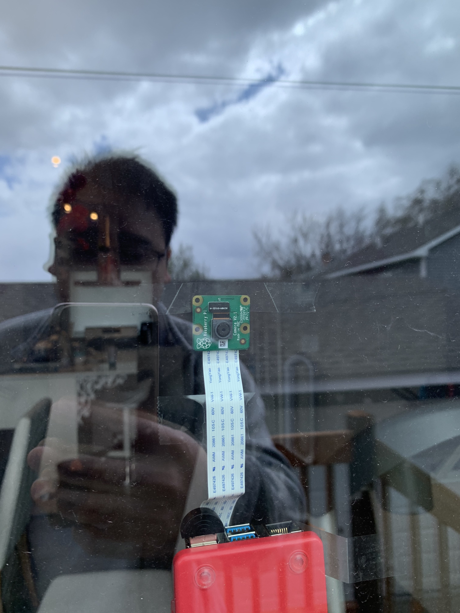
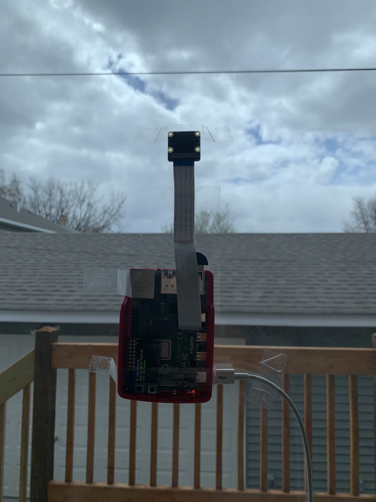
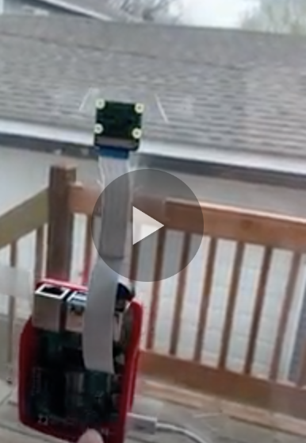
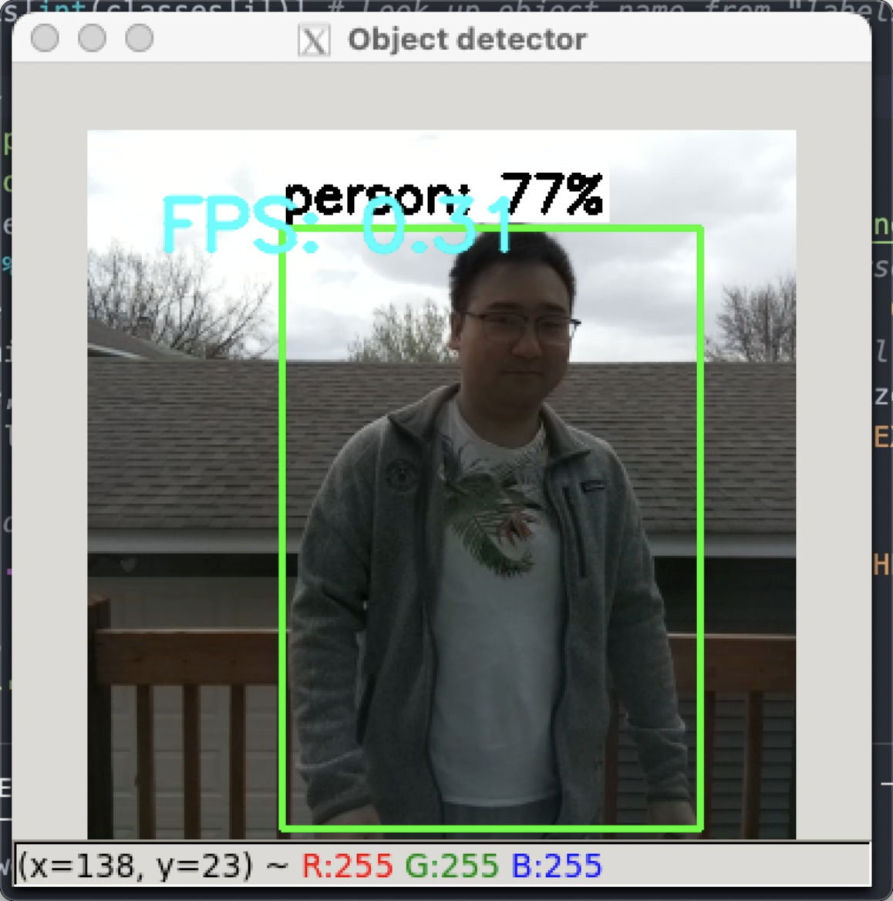
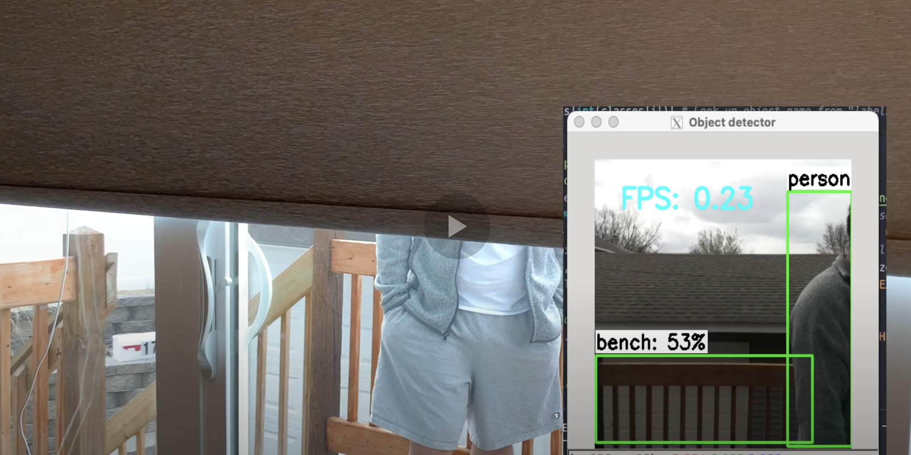

# Observant Systems


For lab this week, we focus on creating interactive systems that can detect and respond to events or stimuli in the environment of the Pi, like the Boat Detector we mentioned in lecture. 
Your **observant device** could, for example, count items, find objects, recognize an event or continuously monitor a room.

This lab will help you think through the design of observant systems, particularly corner cases that the algorithms need to be aware of.

In Lab 5 part 1, we focus on detecting and sense-making.

In Lab 5 part 2, we'll incorporate interactive responses.


## Prep

1.  Pull the new Github Repo.
2.  Read about [OpenCV](https://opencv.org/about/).
3.  Read Belloti, et al's [Making Sense of Sensing Systems: Five Questions for Designers and Researchers](https://www.cc.gatech.edu/~keith/pubs/chi2002-sensing.pdf)

### For the lab, you will need:

1. Raspberry Pi
1. Raspberry Pi Camera (2.1)
1. Microphone (if you want speech or sound input)
1. Webcam (if you want to be able to locate the camera more flexibly than the Pi Camera)

### Deliverables for this lab are:
1. Show pictures, videos of the "sense-making" algorithms you tried.
1. Show a video of how you embed one of these algorithms into your observant system.
1. Test, characterize your interactive device. Show faults in the detection and how the system handled it.


## Overview
Building upon the paper-airplane metaphor (we're understanding the material of machine learning for design), here are the four sections of the lab activity:

A) [Play](#part-a)

B) [Fold](#part-b)

C) [Flight test](#part-c)

D) [Reflect](#part-d)

---

### Part A
### Play with different sense-making algorithms.

Befor you get started connect the RaspberryPi Camera V2. [The Pi hut has a great explanation on how to do that](https://thepihut.com/blogs/raspberry-pi-tutorials/16021420-how-to-install-use-the-raspberry-pi-camera).  

#### OpenCV
A more traditional to extract information out of images is provided with OpenCV. The RPI image provided to you comes with an optimized installation that can be accessed through python.

Additionally, we also included 4 standard OpenCV examples. These examples include contour(blob) detection, face detection with the ``Haarcascade``, flow detection(a type of keypoint tracking), and standard object detection with the [Yolo](https://pjreddie.com/darknet/yolo/) darknet.

Most examples can be run with a screen (I.e. VNC or ssh -X or with an HDMI monitor), or with just the terminal. The examples are separated out into different folders. Each folder contains a ```HowToUse.md``` file, which explains how to run the python example.

```shell
pi@ixe00:~/openCV-examples $ tree -l
.
├── contours-detection
│   ├── contours.py
│   └── HowToUse.md
├── data
│   ├── slow_traffic_small.mp4
│   └── test.jpg
├── face-detection
│   ├── face-detection.py
│   ├── faces_detected.jpg
│   ├── haarcascade_eye_tree_eyeglasses.xml
│   ├── haarcascade_eye.xml
│   ├── haarcascade_frontalface_alt.xml
│   ├── haarcascade_frontalface_default.xml
│   └── HowToUse.md
├── flow-detection
│   ├── flow.png
│   ├── HowToUse.md
│   └── optical_flow.py
└── object-detection
    ├── detected_out.jpg
    ├── detect.py
    ├── frozen_inference_graph.pb
    ├── HowToUse.md
    └── ssd_mobilenet_v2_coco_2018_03_29.pbtxt
```
#### Filtering, FFTs, and Time Series data. (beta, optional)
Additional filtering and analysis can be done on the sensors that were provided in the kit. For example, running a Fast Fourier Transform over the IMU data stream could create a simple activity classifier between walking, running, and standing.

Using the set up from the [Lab 3 demo](https://github.com/FAR-Lab/Interactive-Lab-Hub/tree/Spring2021/Lab%203/demo) and the accelerometer, try the following:

**1. Set up threshold detection** Can you identify when a signal goes above certain fixed values?

The threshold for controlling the ox character in the game is set to abs(4).

**2. Set up averaging** Can you average your signal in N-sample blocks? N-sample running average?

The sampling is set to respond simultaneously for controlling

**3. Set up peak detection** Can you identify when your signal reaches a peak and then goes down?

Yes the peak is around 10.

Include links to your code here, and put the code for these in your repo--they will come in handy later.

Here is the [code](https://github.com/30PandaX/Interactive-Lab-Hub/tree/Spring2021/Lab%203/OXGame)

Here is the game demo based on the accelerometer movement:
[](https://drive.google.com/file/d/1MskJ1UUsyGyfpDd_qfxMUUNfxNTuaPeb/view?usp=sharing)

#### Teachable Machines (beta, optional)
Google's [TeachableMachines](https://teachablemachine.withgoogle.com/train) might look very simple.  However, its simplicity is very useful for experimenting with the capabilities of this technology.

You can train a Model on your browser, experiment with its performance, and then port it to the Raspberry Pi to do even its task on the device.

Here is Adafruit's directions on using Raspberry Pi and the Pi camera with Teachable Machines:

1. [Setup](https://learn.adafruit.com/teachable-machine-raspberry-pi-tensorflow-camera/raspberry-pi-setup)
2. Install Tensorflow: Like [this](https://learn.adafruit.com/running-tensorflow-lite-on-the-raspberry-pi-4/tensorflow-lite-2-setup), but use this [pre-built binary](https://github.com/bitsy-ai/tensorflow-arm-bin/) [the file](https://github.com/bitsy-ai/tensorflow-arm-bin/releases/download/v2.4.0/tensorflow-2.4.0-cp37-none-linux_armv7l.whl) for Tensorflow, it will speed things up a lot.
3. [Collect data and train models using the PiCam](https://learn.adafruit.com/teachable-machine-raspberry-pi-tensorflow-camera/training)
4. [Export and run trained models on the Pi](https://learn.adafruit.com/teachable-machine-raspberry-pi-tensorflow-camera/transferring-to-the-pi)

Alternative less steps option is [here](https://github.com/FAR-Lab/TensorflowonThePi).

#### PyTorch  
As a note, the global Python install contains also a PyTorch installation. That can be experimented with as well if you are so inclined.

### Part B
### Construct a simple interaction.

Pick one of the models you have tried, pick a class of objects, and experiment with prototyping an interaction.
This can be as simple as the boat detector earlier.
Try out different interactions outputs and inputs.
**Describe and detail the interaction, as well as your experimentation.**

The model I tried out is object detection and the class of objects I tried out was "person". My design is to target one of my daily issues. I usually get back to my house through the patio door but sometimes if the shade of the door is closed, I will have to pull out my phone to manually open the shade. 
The interaction is that when the Rasberry Pi detects there is a person walk by, it will help open the shade of the patio automatically.

The picture below shows the device from outside:



The picture below shows the device from inside:



### Part C
### Test the interaction prototype

Now flight test your interactive prototype and **note your observations**:
For example:
1. When does it what it is supposed to do?
1. When does it fail?
1. When it fails, why does it fail?
1. Based on the behavior you have seen, what other scenarios could cause problems?

My design is to target one of my daily issues. I usually get back to my house through the patio door but sometimes if the shade of the door is closed, I will have to pull out my phone to manually open the shade. When the Rasberry Pi detects there is a person walk by, what it supposed to do is to help open the shade of the patio automatically. The only time it failed was due to the WiFi outage. Sometimes when something is very similar to a human being, which is very rare, it might trigger the shade to open.

**Think about someone using the system. Describe how you think this will work.**
1. Are they aware of the uncertainties in the system?
1. How bad would they be impacted by a miss classification?
1. How could change your interactive system to address this?
1. Are there optimizations you can try to do on your sense-making algorithm.

The users are aware of the uncertainties in the system as well as some delays due to network connection. The impact is actually not that bad even though the system falsely detects the object as human. To address this, we can train a more accurate model.  

### Part D
### Characterize your own Observant system

Now that you have experimented with one or more of these sense-making systems **characterize their behavior**.
During the lecture, we mentioned questions to help characterize a material:
* What can you use X for?
This smart shade opener can help you to open the shade of the patio automatically when the Rasberry Pi detects there is a person walk by. 

* What is a good environment for X?
It should be put on a patio door or windows that can be see-through so that you can put the camera on the glass. It has to be in an indoor environment because it is not waterproof. 

* What is a bad environment for X?
It cannot be exposed to outdoor environments because it is not waterproof.

* When will X break?
It will break when power or network outage.

* When it breaks how will X break?
If there is a network outage, the Pi will not be able to communicate with IFTTT to make the API call to control the shade.


**Include a short video demonstrating the answers to these questions.**

[](https://drive.google.com/file/d/16GUs_ELdHrpuVInJLrA5WIDR6k4KHejM/view?usp=sharing)

The detailed answer to this prompt is also included in the next video.

### Part 2.

Following exploration and reflection from Part 1, finish building your interactive system, and demonstrate it in use with a video.

**Include a short video demonstrating the finished result.**



[](https://drive.google.com/file/d/1F8aiiZ8-XZoV1t-gUlWepD78AAuiOTLc/view?usp=sharing)

