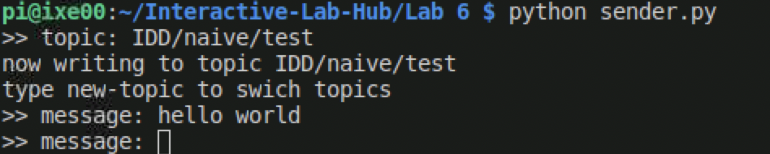
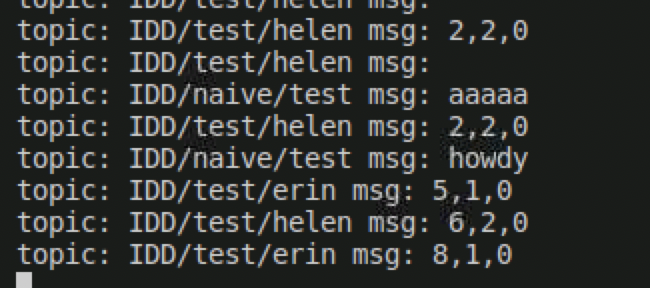
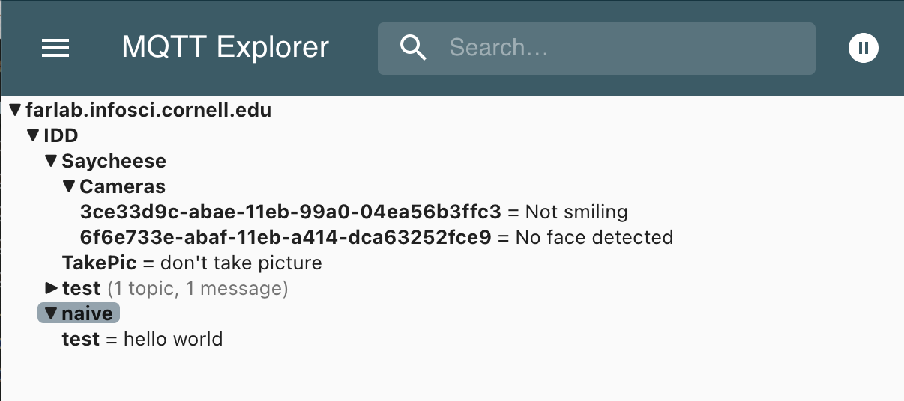
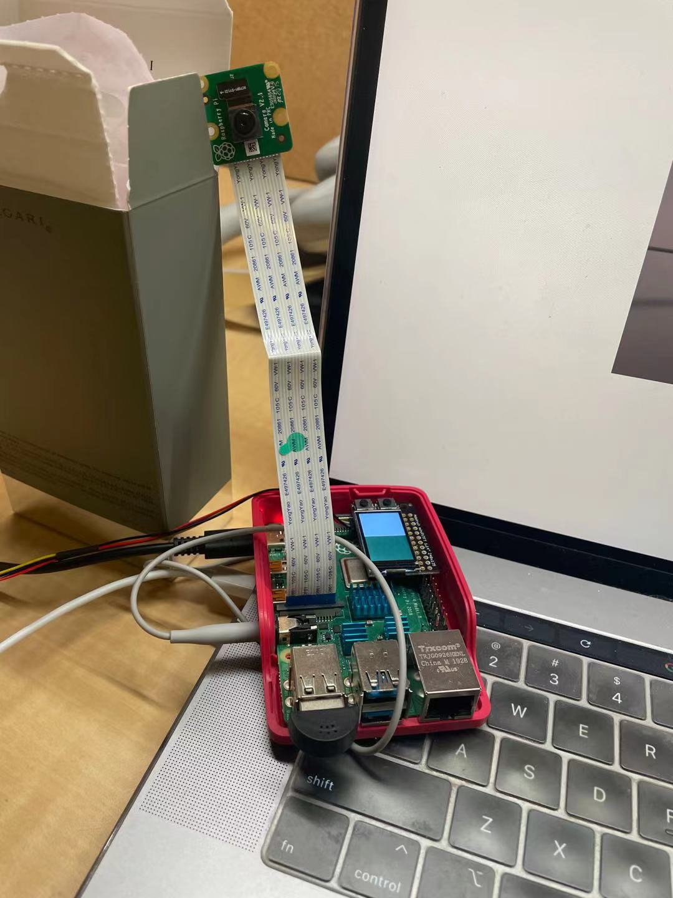
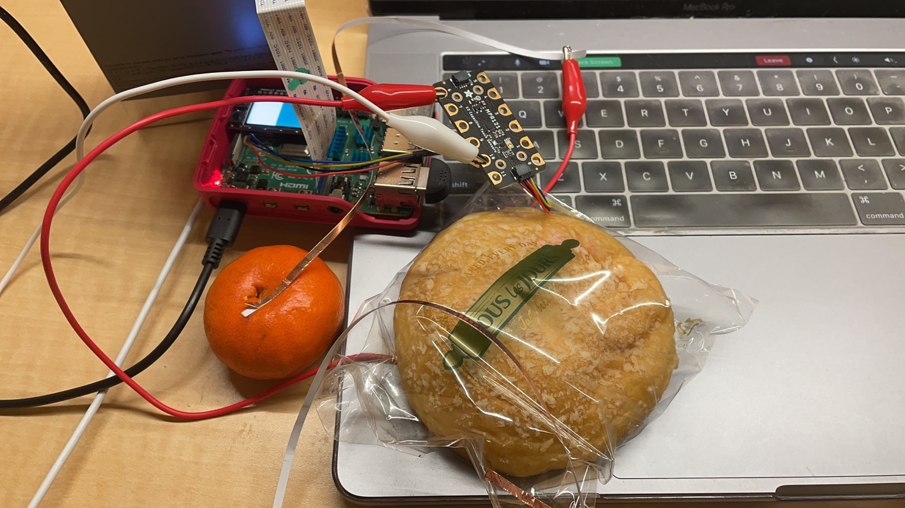
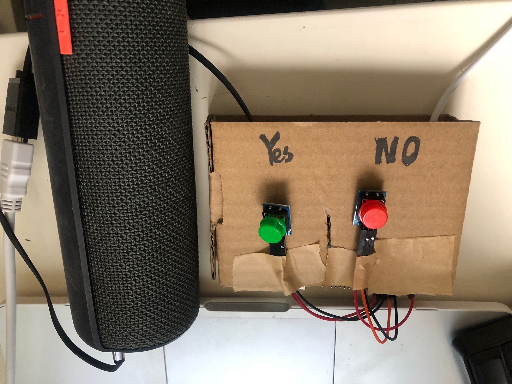
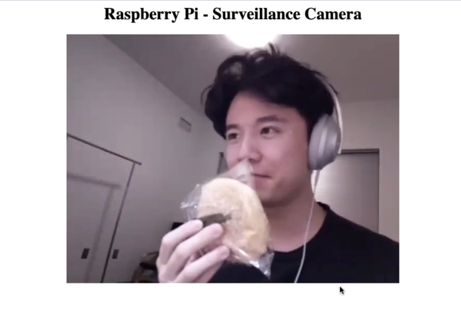

# m[Q](https://en.wikipedia.org/wiki/QAnon)tt[Anon](https://en.wikipedia.org/wiki/QAnon): Where We Go One, We Go All

## Prep

1. Pull the new changes
2. Install [MQTT Explorer](http://mqtt-explorer.com/)
3. Readings 
   * [MQTT](#MQTT)
   * [The Presence Table](https://dl.acm.org/doi/10.1145/1935701.1935800) and [video](https://vimeo.com/15932020)

## Introduction

The point of this lab is to introduce you to distributed interaction. We've included a some Natural Language Processing (NLP) and Generation (NLG) but those are not really the emphasis. Feel free to dig into the examples and play around the code which you can integrate into your projects. However we want to emphasize the grading will focus on your ability to develop interesting uses for messaging across distributed devices. 

## MQTT

MQTT is a lightweight messaging portal invented in 1999 for low bandwidth networks. It was later adopted as a defacto standard for a variety of Internet of Things (IoT) devices. 

### The Bits

* **Broker** - The central server node that receives all messages and sends them out to the interested clients. Our broker is hosted on the far lab server (Thanks David!) at `farlab.infosci.cornell.edu/8883`
* **Client** - A device that subscribes or publishes information on the network
* **Topic** - The location data gets published to. These are hierarchical with subtopics. If you were making a network of IoT smart bulbs this might look like `home/livingroom/sidelamp/light_status` and `home/livingroom/sidelamp/voltage`. Subscribing to `home/livingroom/sidelamp/#` would give you message updates to both the light_status and the voltage. Because we use this broker for a variety of projects you have access to read, write and create subtopics of `IDD`. This means `IDD/ilan/is/a/goof` is a valid topic you can send data messages to.
*  **Subscribe** - This is a way of telling the client to pay attention to messages the broker sends out on that topic. You can subscribe to a specific topic or subtopics. You can also unsubscribe
* **Publish** - This is a way of sending messages to a topic. You can publish to topics you don't subscribe to. Just remember on our broker you are limited to subtopics of `IDD`

Setting up a broker isn't much work but for the purposes of this class you should all use the broker we've set up for you. 

### Useful Tooling

Debugging and visualizing what's happening on your MQTT broker can be helpful. We like [MQTT Explorer](http://mqtt-explorer.com/). You can connect by putting in the settings from the image below.

Once connected you should be able to see all the messaged on the IDD topic. From the interface you can send and plot messages as well.

## Send and Receive

[sender.py](./sender.py) and and [reader.py](./reader.py) show you the basics of using the mqtt in python.  Lets spend a few minutes running these and seeing how messages are transferred and show up.

**Running Examples**

* Install the packages from `requirements.txt`, ideally in a python environment. We've been using the circuitpython environment we setup earlier this semester. To install them do `pip install -r requirements.txt`
* to run `sender.py` type `python sender.py` and fill in a topic name, then start sending messages. You should see them on MQTT Explorer
* to run `reader.py` type `python reader.py` and you should see any messages being published to `IDD/` subtopics.

Running sender.py:

Running reader.py:

On MQTT explorer:

## The One True ColorNet

It is with great fortitude and resilience that we shall worship at the altar of the *OneColor*. Through unity of the collective RGB we too can find unity in our heart, minds and souls. With the help of machines can  overthrow the bourgeoisie, get on the same wavelength (this was also a color pun) and establish [Fully Automated Luxury Communism](https://en.wikipedia.org/wiki/Fully_Automated_Luxury_Communism).

The first step on the path to *collective* enlightenment, plug in the [APDS-9960 Proximity, Light, RGB, and Gesture Sensor](https://www.adafruit.com/product/3595).

You are almost there!

The second step to achieving our great enlightenment is to run `python color.py`

You will find the two squares on the display. Half is showing an approximation of the output from the color sensor. The other half is up to the collective. Press the top button to share your color with the class. Your color is now our color, our color is now your color. We are one. 

I was not super careful with handling the loop so you may need to press more than once if the timing isn't quite right. Also I have't load tested it so things might just immediately break when every pushes the button at once.

You may ask "but what if I missed class?"

Am I not admitted into the collective enlightenment of the *OneColor*?

Of course not! You can got to [https://one-true-colornet.glitch.me/](https://one-true-colornet.glitch.me/) and become one with the ColorNet on the inter-webs.

Glitch is a great tool for prototyping sites, interfaces and web-apps that's worth taking some time to get familiar with if you have a chance. Its not super pertinent for the class but good to know either way. 

We called our design "Food Surveillance System" because we were thinking that our food, especially those delicious snacks are the most important thing we care about in our apartment. 

## Make it your own

I worked this lab with Songyu Du and Zhonghao Zhan.

**1. Explain your design** For example, if you made a remote controlled banana piano, explain why anyone would want such a thing.

We called our design "Food Surveillance System" because we were thinking that our food, especially those delicious snacks is the most important thing we care about in our apartment. Therefore, we designed this Food Surveillance System that is able to inform the food owner when their food is touched. Then the food owner will have a chance to press yes or no to inform the food eater if is okay to eat their food.

**2. Diagram the architecture of the system.** Be clear to document where input, output and computation occur, and label all parts and connections. For example, where is the banana, who is the banana player, where does the sound get played, and who is listening to the banana music?

The architecture of the system is shown in the diagram below. The input, output and computation and parts and connections are labeled accordingly. 

The banana, which is snack in our case, is in the food eater side. When the food eater pick up the food, the pi in food owner side will say "cookies is touched!" over the speaker to inform that the food is bing touched. The food owners can press the yes or no button to indicate if they want to share the food. The pi speaker in food eater side will say "Go ahead and enjoy it!" of "Don't touoch my food" to inform the eater.

**3. Build a working prototype of the system.** Do think about the user interface: if someone encountered these bananas, would they know how to interact with them? Should they know what to expect?

We prototyped the **thief** side of system as shown in the pictures below.

A pi camera and a speaker are connected to the raspberry pi.

We used alligator clips and copper wires to connect several types of food to the capacitive sensor, which is connected to the Raspberry Pi. The food eater will know how to interact with the system because all they need to do is to pick up the food and get informed by the speaker if they are supposed to eat it.

We prototyped the **owner** side of system as shown in the pictures below.

Two buttons and a speaker are connected to the raspberry pi. The owner would know which button to press for his/her decision.

Below is a screenshot of the streamed video of the thief on food owner's personal device. The owner could access it from a browser.

**4. Document the working prototype in use.** It may be helpful to record a Zoom session where you should the input in one location clearly causing response in another location.

Here is the video that shows the interaction between the Food Surveillance System, a food eater, and a food owener

(click to view the vid)

**5. BONUS (Wendy didn't approve this so you should probably ignore it)** get the whole class to run your code and make your distributed system BIGGER.
